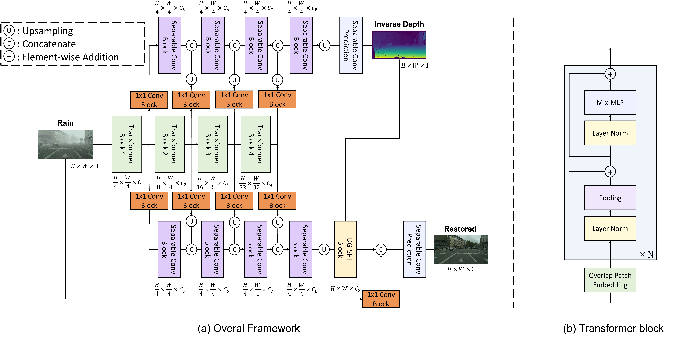
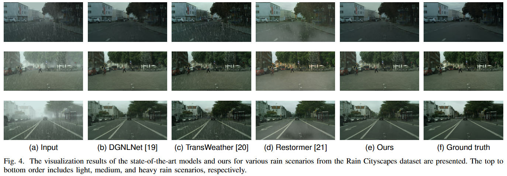
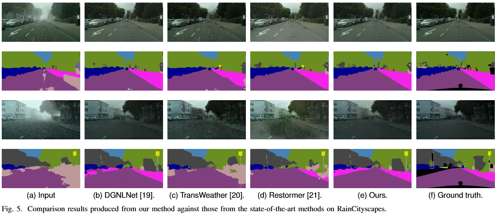

# The Depth-Guided Features and Semantic Loss based Rain Removal Method for Enhancing Scene Understanding

Note: The code will be released publicly available upon acceptance of this work by a journal.

## Abstact

The spatial visibility of rain within the image space exhibits variability, with proximate objects mainly influenced by rain streaks, whereas distant objects are more significantly impacted by fog. Existing methods typically focus merely on removing rain streaks, neglecting the fog effect, which limits their effectiveness. Current semantic segmentation methods, essential for scene understanding in autonomous driving, exhibit vulnerability to such environmental disturbances. However, there is little discussion about how the quality of restored images affects their performance in semantic segmentation tasks. In this work, we propose an efficient Vision Transformer-based model that integrates a Depth-Guided Spatial Feature Transform block. This block leverages spatial information from an inverse depth map estimated by the model, producing depth-guided features to eliminate the variable spatial visibility caused by rain streaks and fog. Additionally, we introduce a novel semantic loss function that enhances both the restoration quality and accuracy of semantic segmentation models when applied to these restored images. This is achieved by minimizing the probability distribution discrepancy between the segmentation maps of ground truth and restored images. Our method was evaluated on the RainCityscapes dataset, where it outperformed state-of-the-art approaches and demonstrated the lowest latency among all ViT-based methods. Additionally, it achieved speeds comparable to the fastest CNN model. It yields higher mIOU scores with various segmentation models and has shown effectiveness on real-world rain images.

## Architecture

## Comparison on RainCityscapes

## Analysis on downstream task

## Use the Code

**TBD**
